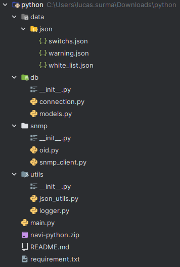

Ce document vous présente en détail l'architecture du projet Python, avec une explication de chaque dossier et fichier, ainsi que leur rôle dans le bon fonctionnement de l'application.

## 🗂️ Dossiers Principaux

### `data/json/`

- **switchs.json** : Fichier JSON contenant probablement des données liées aux commutateurs (switchs).
- **warning.json** : Fichier JSON qui semble stocker des informations d'alerte ou de mise en garde.
- **white_list.json** : Fichier JSON contenant une liste blanche d'adresses ou d'entités autorisées.

### `db/`

- **connection.py** : Script Python gérant les connexions à la base de données.
- **models.py** : Fichier Python définissant les modèles de données (probablement les tables ou objets de la base de données).
- **\_\_init\_\_.py** : Fichier d'initialisation permettant à Python de traiter ce dossier comme un package.

### `snmp/`

- **oid.py** : Script Python contenant les Object Identifiers (OID), qui sont des identifiants utilisés dans SNMP (Simple Network Management Protocol) pour la gestion des réseaux.
- **snmp_client.py** : Client SNMP pour la collecte ou la gestion des données via le protocole SNMP.
- **\_\_init\_\_.py** : Fichier d'initialisation pour le package SNMP.

### `utils/`

- **json_utils.py** : Fichier utilitaire pour la gestion et la manipulation des fichiers JSON.
- **logger.py** : Script Python pour la gestion des logs et des événements dans l'application.
- **\_\_init\_\_.py** : Fichier d'initialisation pour le package utils.

## 📄 Fichiers Racine

- **main.py** : Point d'entrée principal de l'application Python.
- **README.md** : Fichier de documentation contenant probablement des instructions sur l'installation et l'utilisation du projet.
- **requirement.txt** : Fichier listant les dépendances nécessaires pour exécuter le projet.
