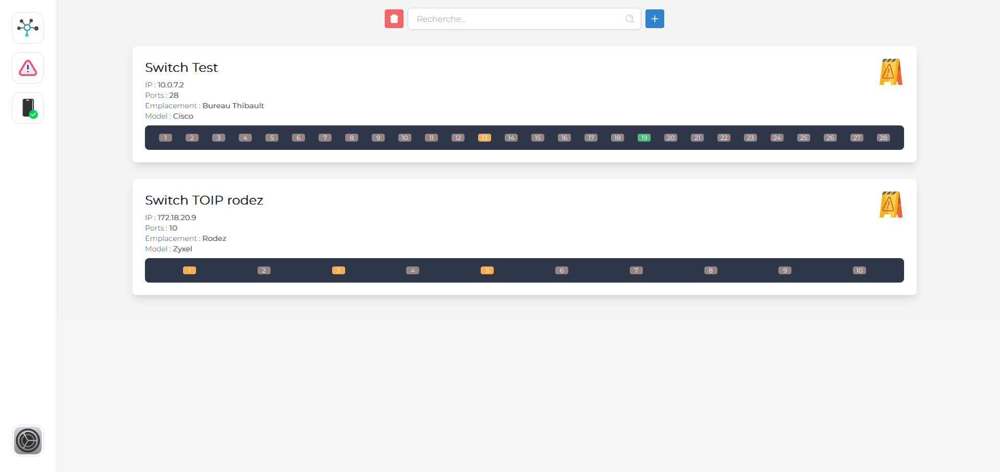
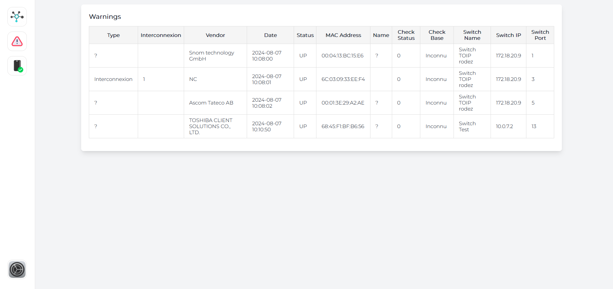
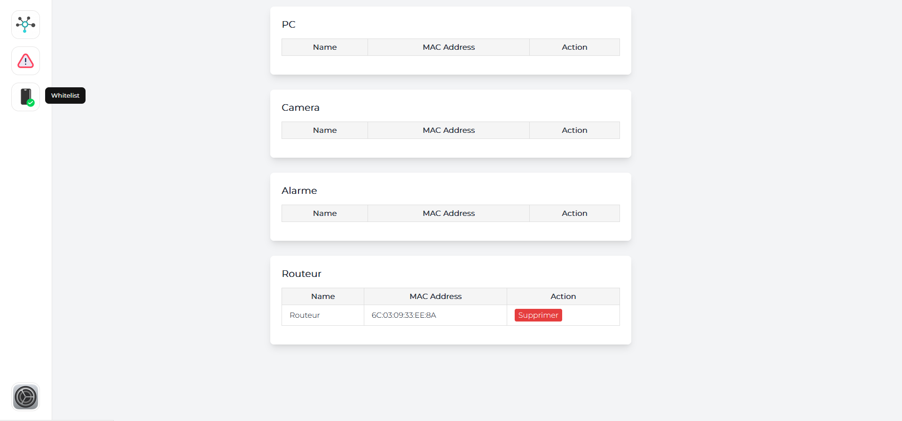
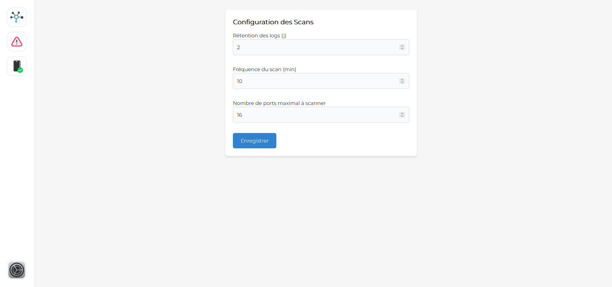

# ℹ️ Navi - Web

Cette partie du projet constitue le front-end de la partie logicielle [`Navi - Python`](http://vm-github:8082/gitlab-signauxgirod/navi/python). 

Elle permet de centraliser et d'afficher les données retournées lors des scans des différents switchs.

## 🖥️ Pages Disponibles

Voici un aperçu des différentes pages disponibles dans cette application :

### 🏠 Accueil



### ⚠️ Warning



### 📩 WhiteList



### 🔧 Paramètres



## 📌 Autres Informations

Pour consulter la documentation relative à ce projet, veuillez vous rendre dans le menu :

```bash
Plan -> Wiki
